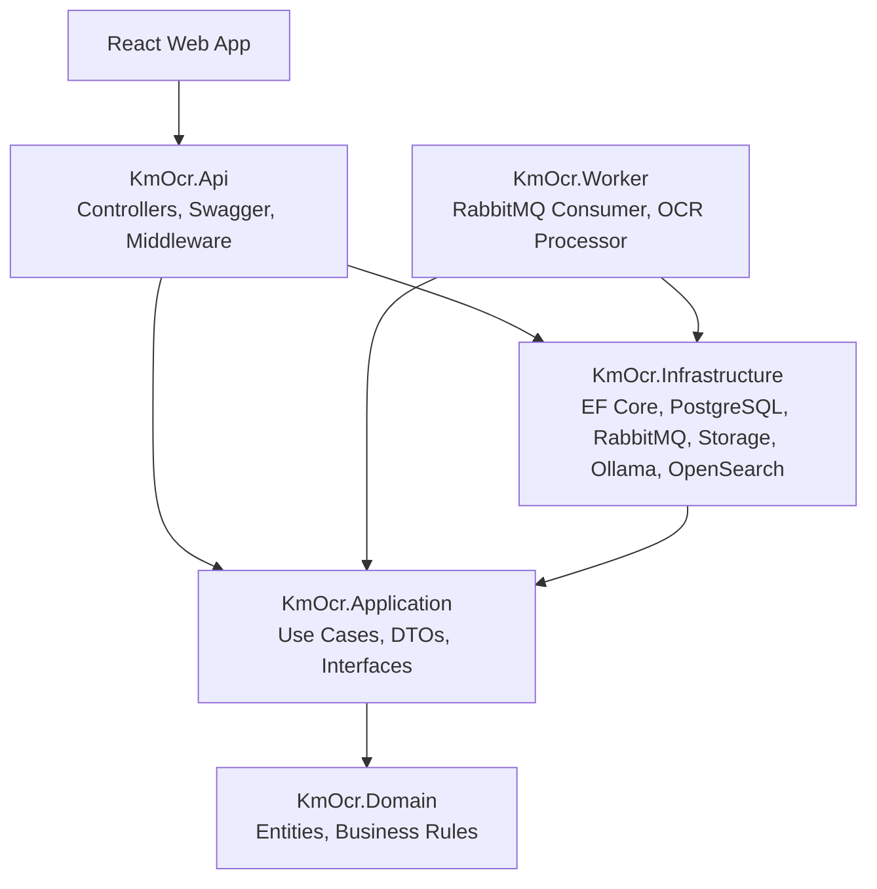
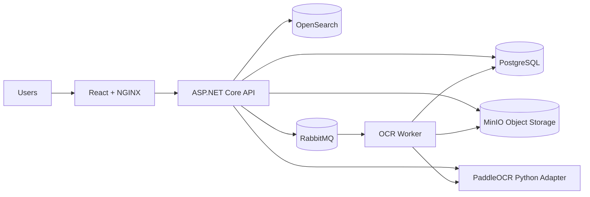

# Software Architecture

## Clean Architecture

## Runtime Architecture

## Modules

| Module | Responsibility |
|---|---|
| Document | Upload, folders, metadata, versions, download, preview, move, delete, OCR status, OCR result |
| OCR | PaddleOCR extraction for PDF, JPG, PNG, Thai, and English JSON output |
| AI | Ollama-backed classification, summary, and metadata extraction with configurable local model |
| Workflow | Start workflow, assign task, approve, reject |
| Node Workflow Engine | Design, validate, and publish node graphs for OCR, AI, Email, Folder, Webhook, Condition, Loop, and Approval workflows |
| Search | OpenSearch indexing and highlighted search across document, OCR, AI, and metadata fields |
| Dashboard | Enterprise charts and metrics for OCR, workflow, users, errors, performance, storage, and throughput |
| Identity and Access | Login, JWT, refresh rotation, RBAC, permissions, logout revocation |
| Messaging | Publish and consume OCR jobs through RabbitMQ |
| Storage | Store document binaries in MinIO and keep metadata in PostgreSQL |
| Audit | Data model foundation for compliance events |

## SOLID Mapping

| Principle | Implementation |
|---|---|
| Single Responsibility | Domain entities, use case modules, repositories, controllers are separated |
| Open/Closed | OCR processor and storage can be replaced through interfaces |
| Liskov Substitution | Interfaces use behavior-focused contracts |
| Interface Segregation | Persistence, storage, and messaging interfaces are split |
| Dependency Inversion | Application depends on abstractions, Infrastructure implements them |

## Production Notes

- PaddleOCR runs through a Python process adapter so the .NET application layer stays independent from OCR engine details.
- Docker runtime images install Python, PaddleOCR, PaddlePaddle, Poppler, and image processing dependencies for Linux execution.
- Add Keycloak or OpenIddict before production user rollout.
- Move JWT signing and seeded administrator credentials to a secret manager before production rollout; the checked-in values are development-only examples.
- MinIO is the default object storage for document binaries; PostgreSQL stores metadata, folder placement, version records, and soft-delete audit state.
- Node workflow definitions are stored as normalized nodes/edges in PostgreSQL and published as immutable JSON graph versions before runtime execution.
- Ollama is the default AI provider. Change `OLLAMA_MODEL` to switch local models without code changes, or set `AI_PROVIDER=Keyword` for deterministic development extraction.
- OpenSearch stores a searchable read model only; PostgreSQL remains the source of truth. Rebuild index entries from `POST /api/v1/search/documents/{documentId}/index` when document, OCR, AI, or metadata values need to be refreshed.
- Add EF Core migrations once .NET SDK is installed in CI.
- Add OpenSearch when search volume grows beyond PostgreSQL-backed filtering.
- Put API and worker behind observability with Prometheus, Grafana, and Loki.
