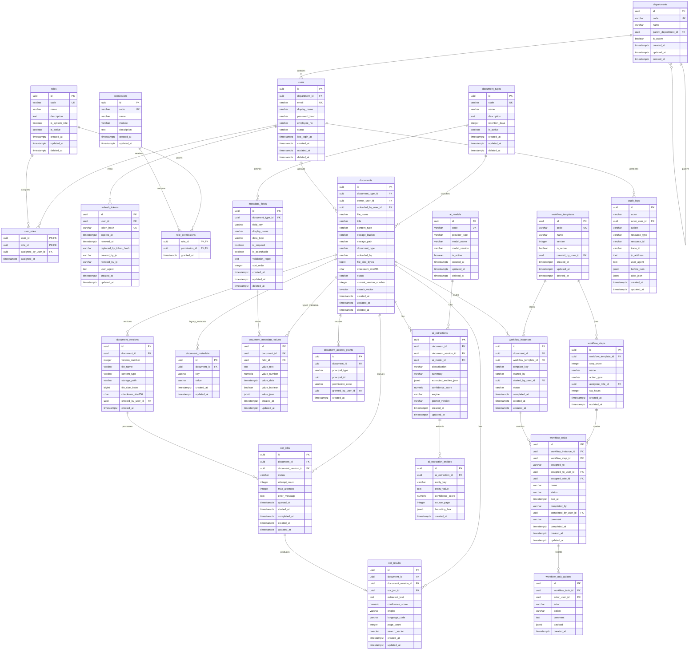

# ER Diagram

```mermaid
erDiagram
  departments ||--o{ departments : parent
  departments ||--o{ users : contains

  users ||--o{ user_roles : receives
  users ||--o{ refresh_tokens : owns
  roles ||--o{ user_roles : assigned
  roles ||--o{ role_permissions : grants
  permissions ||--o{ role_permissions : contains

  document_types ||--o{ metadata_fields : defines
  document_types ||--o{ documents : classifies
  users ||--o{ documents : uploads
  documents ||--o{ document_versions : versions
  documents ||--o{ document_metadata : legacy_metadata
  documents ||--o{ document_metadata_values : typed_metadata
  metadata_fields ||--o{ document_metadata_values : stores
  documents ||--o{ document_access_grants : secures

  documents ||--o{ ocr_jobs : queues
  document_versions ||--o{ ocr_jobs : processes
  documents ||--o{ ocr_results : has
  ocr_jobs ||--o| ocr_results : produces

  ai_models ||--o{ ai_extractions : runs
  documents ||--o{ ai_extractions : has
  ai_extractions ||--o{ ai_extraction_entities : extracts

  workflow_templates ||--o{ workflow_steps : has
  workflow_templates ||--o{ workflow_instances : starts
  workflow_steps ||--o{ workflow_tasks : creates
  documents ||--o{ workflow_instances : routes
  workflow_instances ||--o{ workflow_tasks : contains
  workflow_tasks ||--o{ workflow_task_actions : records

  users ||--o{ audit_logs : performs

  departments {
    uuid id PK
    varchar code UK
    varchar name
    uuid parent_department_id FK
    boolean is_active
    timestamptz created_at
    timestamptz updated_at
    timestamptz deleted_at
  }

  users {
    uuid id PK
    uuid department_id FK
    varchar email UK
    varchar display_name
    varchar password_hash
    varchar employee_no
    varchar status
    timestamptz last_login_at
    timestamptz created_at
    timestamptz updated_at
    timestamptz deleted_at
  }

  refresh_tokens {
    uuid id PK
    uuid user_id FK
    varchar token_hash UK
    timestamptz expires_at
    timestamptz revoked_at
    varchar replaced_by_token_hash
    varchar created_by_ip
    varchar revoked_by_ip
    text user_agent
    timestamptz created_at
    timestamptz updated_at
  }

  roles {
    uuid id PK
    varchar code UK
    varchar name
    text description
    boolean is_system_role
    boolean is_active
    timestamptz created_at
    timestamptz updated_at
    timestamptz deleted_at
  }

  permissions {
    uuid id PK
    varchar code UK
    varchar name
    varchar module
    text description
    timestamptz created_at
    timestamptz updated_at
  }

  user_roles {
    uuid user_id PK, FK
    uuid role_id PK, FK
    uuid assigned_by_user_id FK
    timestamptz assigned_at
  }

  role_permissions {
    uuid role_id PK, FK
    uuid permission_id PK, FK
    timestamptz granted_at
  }

  document_types {
    uuid id PK
    varchar code UK
    varchar name
    text description
    integer retention_days
    boolean is_active
    timestamptz created_at
    timestamptz updated_at
    timestamptz deleted_at
  }

  documents {
    uuid id PK
    uuid document_type_id FK
    uuid owner_user_id FK
    uuid uploaded_by_user_id FK
    varchar file_name
    varchar title
    varchar content_type
    varchar storage_bucket
    varchar storage_path
    varchar document_type
    varchar uploaded_by
    bigint file_size_bytes
    char checksum_sha256
    varchar status
    integer current_version_number
    tsvector search_vector
    timestamptz created_at
    timestamptz updated_at
    timestamptz deleted_at
  }

  document_versions {
    uuid id PK
    uuid document_id FK
    integer version_number
    varchar file_name
    varchar content_type
    varchar storage_path
    bigint file_size_bytes
    char checksum_sha256
    uuid created_by_user_id FK
    timestamptz created_at
  }

  metadata_fields {
    uuid id PK
    uuid document_type_id FK
    varchar field_key
    varchar display_name
    varchar data_type
    boolean is_required
    boolean is_searchable
    text validation_regex
    integer sort_order
    timestamptz created_at
    timestamptz updated_at
    timestamptz deleted_at
  }

  document_metadata {
    uuid id PK
    uuid document_id FK
    varchar key
    varchar value
    timestamptz created_at
    timestamptz updated_at
  }

  document_metadata_values {
    uuid id PK
    uuid document_id FK
    uuid field_id FK
    text value_text
    numeric value_number
    timestamptz value_date
    boolean value_boolean
    jsonb value_json
    timestamptz created_at
    timestamptz updated_at
  }

  document_access_grants {
    uuid id PK
    uuid document_id FK
    varchar principal_type
    uuid principal_id
    varchar permission_code
    uuid granted_by_user_id FK
    timestamptz created_at
  }

  ocr_jobs {
    uuid id PK
    uuid document_id FK
    uuid document_version_id FK
    varchar status
    integer attempt_count
    integer max_attempts
    text error_message
    timestamptz queued_at
    timestamptz started_at
    timestamptz completed_at
    timestamptz created_at
    timestamptz updated_at
  }

  ocr_results {
    uuid id PK
    uuid document_id FK
    uuid document_version_id FK
    uuid ocr_job_id FK
    text extracted_text
    numeric confidence_score
    varchar engine
    varchar language_code
    integer page_count
    tsvector search_vector
    timestamptz created_at
    timestamptz updated_at
  }

  ai_models {
    uuid id PK
    varchar code UK
    varchar provider_type
    varchar model_name
    varchar model_version
    boolean is_active
    timestamptz created_at
    timestamptz updated_at
    timestamptz deleted_at
  }

  ai_extractions {
    uuid id PK
    uuid document_id FK
    uuid document_version_id FK
    uuid ai_model_id FK
    varchar classification
    varchar summary
    jsonb extracted_entities_json
    numeric confidence_score
    varchar engine
    varchar prompt_version
    timestamptz created_at
    timestamptz updated_at
  }

  ai_extraction_entities {
    uuid id PK
    uuid ai_extraction_id FK
    varchar entity_key
    text entity_value
    numeric confidence_score
    integer source_page
    jsonb bounding_box
    timestamptz created_at
  }

  workflow_templates {
    uuid id PK
    varchar code UK
    varchar name
    integer version
    boolean is_active
    uuid created_by_user_id FK
    timestamptz created_at
    timestamptz updated_at
    timestamptz deleted_at
  }

  workflow_steps {
    uuid id PK
    uuid workflow_template_id FK
    integer step_order
    varchar name
    varchar action_type
    uuid assignee_role_id FK
    integer sla_hours
    timestamptz created_at
    timestamptz updated_at
  }

  workflow_instances {
    uuid id PK
    uuid document_id FK
    uuid workflow_template_id FK
    varchar template_key
    varchar started_by
    uuid started_by_user_id FK
    varchar status
    timestamptz completed_at
    timestamptz created_at
    timestamptz updated_at
  }

  workflow_tasks {
    uuid id PK
    uuid workflow_instance_id FK
    uuid workflow_step_id FK
    varchar assigned_to
    uuid assigned_to_user_id FK
    uuid assigned_role_id FK
    varchar name
    varchar status
    timestamptz due_at
    varchar completed_by
    uuid completed_by_user_id FK
    varchar comment
    timestamptz completed_at
    timestamptz created_at
    timestamptz updated_at
  }

  workflow_task_actions {
    uuid id PK
    uuid workflow_task_id FK
    uuid actor_user_id FK
    varchar actor
    varchar action
    text comment
    jsonb payload
    timestamptz created_at
  }

  audit_logs {
    uuid id PK
    varchar actor
    uuid actor_user_id FK
    varchar action
    varchar resource_type
    varchar resource_id
    varchar trace_id
    inet ip_address
    text user_agent
    jsonb before_json
    jsonb after_json
    timestamptz created_at
    timestamptz updated_at
  }
```
